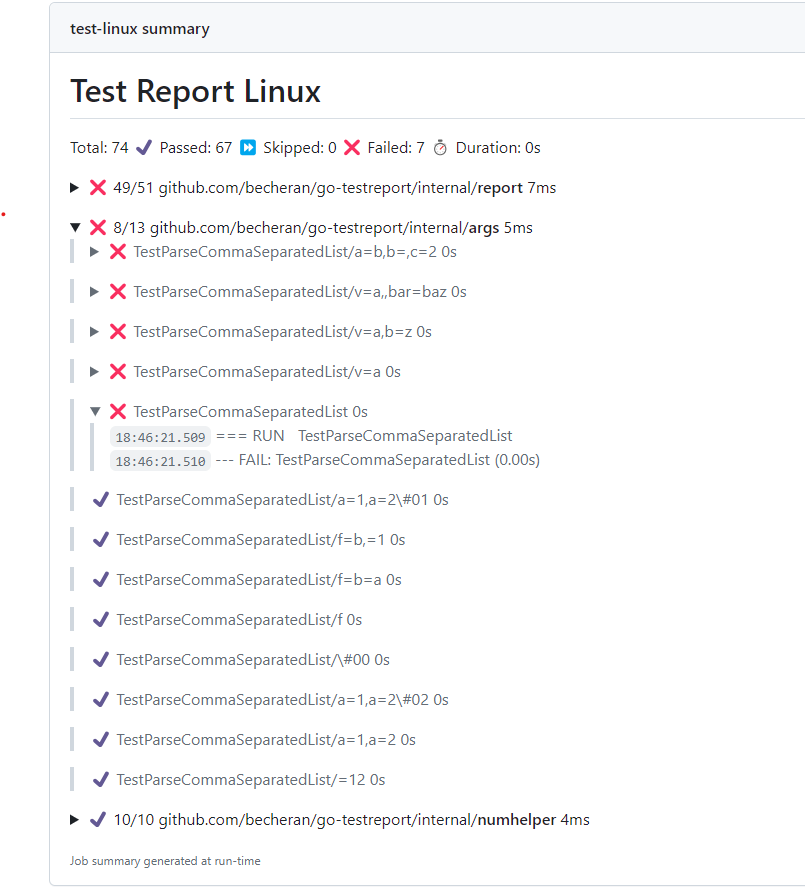

[](https://docs.stepsecurity.io/actions/stepsecurity-maintained-actions)

# Go Test Report

[![License][license-image]][license-url]

[license-url]: https://github.com/step-security/go-testreport/blob/main/LICENSE
[license-image]: https://img.shields.io/badge/License-MIT-brightgreen.svg

Generate a markdown test report from the go json test result.

Matches perfectly with [github job summaries]( https://github.blog/news-insights/product-news/supercharging-github-actions-with-job-summaries/) to visualize test results:



The default output sorts the tests by failing and slowest execution time.

## Usage

### GitHub Actions

The [Golang Test Report](https://github.com/step-security/go-testreport) from the marketplace can be used to integrate the go-testreport tool into a GitHub workflow:

``` yaml
- name: Test
  run: go test ./... -json > report.json
- name: Report
  uses: step-security/go-testreport@v0
  with:
    input: report.json
```

### Inputs

| Input              | Description                                                        | Required | Default               |
| ------------------ | ------------------------------------------------------------------ | -------- | --------------------- |
| `input`            | Test report json file path                                         | Yes      |                       |
| `output`           | Output file path                                                   | No       | `$GITHUB_STEP_SUMMARY`|
| `template`         | Template file. Default will be used if empty                       | No       |                       |
| `templateVariables`| Variables for template files. Default will be used if empty        | No       |                       |
